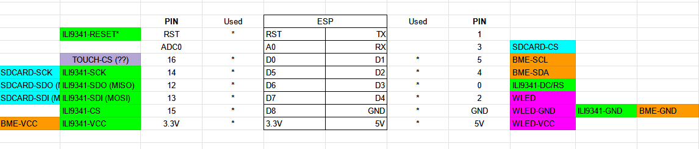

# Welcome to my project, Cyberpunk Clock
It's my first project, so please be kind :)

# Results
First thing, the final design and functionalities : 
- Amazing Led CyberPunk Logo based on the wonderful project WLED (with interface and a lot of things)
- Screen to see time, date, and if you have sensor temperature and humidity
- Touch screen to switch off the led

Images & videos:   

# Prerequisite & Materials
Skills : 
- Patience
- A little bit of programming
- Electronic: you need to know how to solder

Materials:
- A 3D printer  
- Electronic stuff like solder & co  
- A TFT ili9341 with touch capacity. I used the fantastic [TFT_eSPI library](https://github.com/Bodmer/TFT_eSPI/); a lot of other screens are compatible (check on the project)  
- A ESP, at the beginning, I used an ESP8266, but due to a lack of memory, I switched to an ESP32 with PS Ram; in my case, it's an ESP32-S2 mini (but there is a lot of ESP32)  
- An LED strip compatible with wonderful [WLED](https://github.com/Aircoookie/WLED) (check the project); in my case I bought a smaller LED WS2812B with only a 5 mm large  

# Instruction
## CyberPunk Logo
I started with the CyberPunk logo. This is [the link to the STL files](https://www.thingiverse.com/thing:4679493/files), and I read how other people have done the wiring.   
For the 3D print, I used default settings; for the case, a classic black PLA, and for the top, I used a semi-transparent PETG (because it was in my stock).  
The soldering of all LEDs is a big job and a little bit tricky; in my case, I had done a small part outside of the logo and made the connection when it was easy.  
I've also tested each time with a default WLED installation on my ESP8266 (it was before my switch to ESP32) to see if the LEDs are correctly connected.  
To resume, it was a little bit boring, but in the end, when you try different effects, you've got a first wahoo effect  

## The Clock

# Credits
Thanks to CD Projekt for the Cyber Punk 2077 game (and all trademarks for us).
Thanks to Mr. Josef Prusa for the 3D printer. For making dreams a reality.
Thanks to the community from Wled on the discord 

