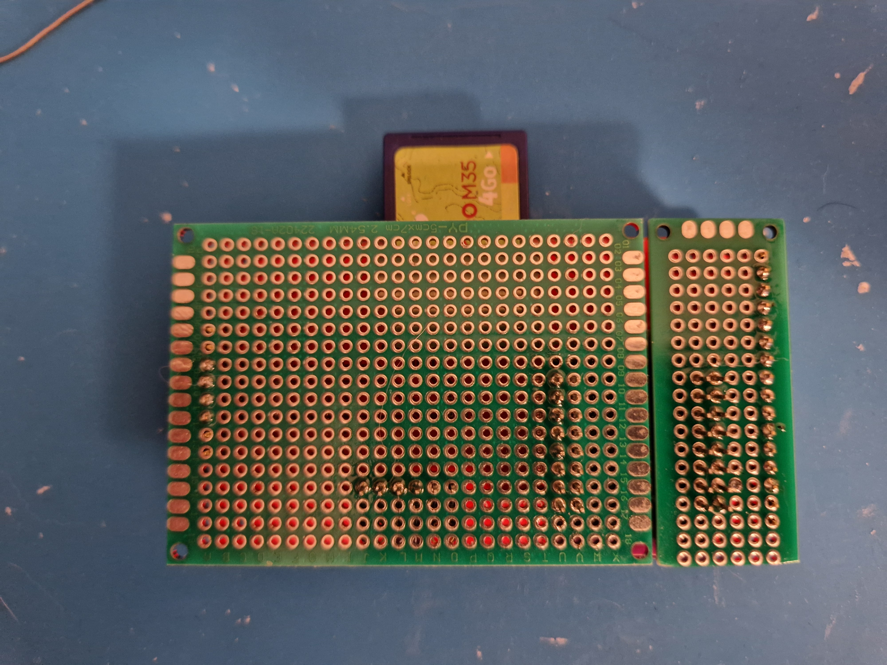

# Welcome to my project, Cyberpunk Clock
It's my first project, so please be kind :)

# Results

First thing, the final design and functionalities : 
- Amazing Led CyberPunk Logo based on the wonderful project WLED (with interface and a lot of things)
- Screen to see time, date, and if you have sensor temperature and humidity
- Touch screen to switch off the led

# Prerequisite & Materials
Skills : 
- Patience
- A little bit of programming
- Electronic: you need to know how to solder

Materials:
- A 3D printer  
- Electronic stuff like solder & co  
- A TFT ili9341 with touch capacity. I used the fantastic [TFT_eSPI library](https://github.com/Bodmer/TFT_eSPI/); a lot of other screens are compatible (check on the project)  
- A ESP, at the beginning, I used an ESP8266, but due to a lack of memory, I switched to an ESP32 with PS Ram; in my case, it's an ESP32-S2 mini (but there is a lot of ESP32)  
- An LED strip compatible with [WLED](https://github.com/Aircoookie/WLED) (check the project); in my case I bought a smaller LED WS2812B with only a 5 mm large  

# Instruction
## CyberPunk Logo
I started with the CyberPunk logo. This is [the link to the STL files](https://www.thingiverse.com/thing:4679493/files), and I read how other people have done the wiring.   
For the 3D print, I used default settings; for the case, a classic black PLA, and for the top, I used a semi-transparent PETG (because it was in my stock).  
The soldering of all LEDs is a big job and a little bit tricky; in my case, I had done a small part outside of the logo and made the connection when it was easy.  
I've also tested each time with a default WLED installation on my ESP8266 (it was before my switch to ESP32) to see if the LEDs are correctly connected.  
To resume, it was a little bit boring, but in the end, when you try different effects, you've got a first wahoo effect  

## The Clock
At the beginning, I started on a classical ESP8266, for the conenction you can use this:

However, when I used the TFT and Wled library, the memory was not enough to handle the background image on the "minute" display.  
I already use workaround in my code to avoid too many ressource, like load background image on the change of hour, so the "hour" isn't redraw.  
Perhaps, with more memory optimization, in my module and TFT and WLED project it's possible, but to be honest C++ is not my job just an hobbie.  
So long story short, if you have an ESP8266 you can use this module, but you will have a black background on the minute.  
If you have ESP32, with PS Ram, let's go  
Wiring on ESP32 S2 Mini  

In my module, I used an another mod V2, thanks to [BME280_v2](https://github.com/Aircoookie/WLED/tree/main/usermods/BME280_v2) who provide function to get temparuture and other stuff  
After the wiring, I created a box for the clock with hole for USB, Pin to connect leg and big hole for the SD card.
My design is on OnShape, so if you want to remix, feel free. 
[Link to CyberPunk Box](https://cad.onshape.com/documents/0ec2d05544ebf5b75362955c/w/2196f995b413a02e7a25c0e7/e/7b50c2d1ddb9066b0d95971f?renderMode=0&uiState=660030a2cb9cb5171f0dd871)

## The Support
My idea is to integrate all this into a single object, but I like module parts.  
Yes, I know I have a 3D printer, so I could print all in a single, but I prefer to make different modules.  
And yes, I use glue between each part (from a 3D printer man it's could be horrible)  
But, by this way, you can modify all parts as you need.  
The mount between the clock and the logo  
[Link to the mount](https://cad.onshape.com/documents/36fdbed2e2aa1ef3eded8675/w/fec956f36eaeb1502a5425e6/e/0c0e220b4aa753bca2f42ea8?renderMode=0&uiState=66003367c1c4d963c4f2290c)

For the desgign, on the support I tried to keep an cyberpunk aspect (with a "2" profile)  
[Link to the support](https://cad.onshape.com/documents/31070edaba85cf5046969ab0/w/2220fcad144101c9cb095c4e/e/76bb540df0e3aaddd11e8a31?renderMode=0&uiState=66003331cb9cb5171f0ddf3e)

# Story
This project is started, from my interests. 
* I love learn new thing (or relearn like the C++)
* The Cyberpunk univers (I read a lot of SF books, and the Cyberpunk 2077 from CD Projekt game is amazing)
* I've a 3D printer
* And last but not list for the fun

## The background
## Wiring Leds phase on the Logo

As you can see, it's a mess ;-)  
On the ESP8266, it's work  

On ESP32 S2 Mini

The final mount
Front 

Back at the start  

Back with modules  

The TFT with touch pin solder

The sandwich  

Back with the wires  

Test with the touch  

The Mount

The Mount with the Logo

The back 

The support

The support side

# Credits
Thanks to CD Projekt for the Cyber Punk 2077 game (and all trademarks for us).  
Thanks to Mr. Josef Prusa for the 3D printer. For making dreams a reality.  
Thanks to the community from Wled on the Discord (I asked a question less than 2 minutes after I've got the perfect answer)  
Thanks to the creator of the BME280_v2  
Thanks to OnShape for this 3D editor  

